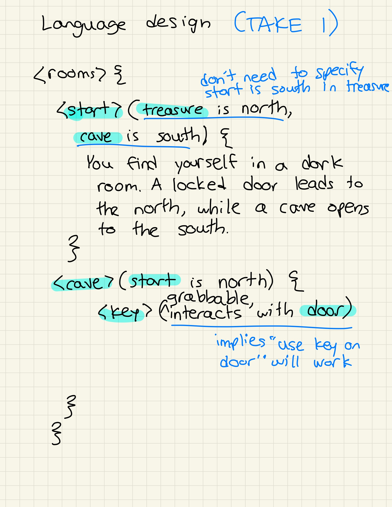

# Design notebook entry

## Last week's critique

The critique had a lot of nice comments as well as some useful feedback! The analysis of my intended audience (writers with little to no CS experience) and having a full week for revisions and testing were highlighted as standouts of my pitch. Additionally, my thoughts about debugging/error handling and designing with possible expansion in mind were critiqued. I'd like to discuss what I've done with these last two this week below.

Prioritizing custom error handling, both in parsing the DSL and when running the game is a great point. I've seen that the parsing package I'm using (pyparsing) has some decent error-checking built in, but I need to implement error handling for any processing that's done outside of that package - and right now, there's a decent amount of that. My goal is to learn more about the pyparsing package as the weeks go on and start to do more and more within the package so I'm better covered with errors there. 

I also agree that while it's interesting to design my code base in mind for potential expansion, too much focus on that would distract from the core focus of DSL design and parsing. As the weeks go on, I'll focus my efforts in this space by making my code intuitive and readable, and not spend time making any specific structures to aid language expansion.

## Description

I started by focusing in on room navigation. What I mean by this is when you are in the game, being able to say 'go south' or 'go west' and be able to navigate to that adjacent room when there is one present. I then sketched out the DSL design for room declaration, text, and navigation, where I settled on an HTML-like structure with directions specified in clear English. See the picture of my design below:

Once the initial DSL was solidified, I implemented the backend to make it all work. I built an Engine class that has the game loop (while True) and parses user input for expected commands. I also wrote a Room class to handle each room, which right now includes a room ID, room text (that gets printed when you enter it) and a 4-member array of ints that connects to the room IDs of adjacent rooms. 

My last task this week was to write up a game with just connected rooms in my DSL (done in a file named adventure.game), then implement the parsing and linking with my backend. After some searching, I decided to use the pyparsing package because it is robust and well-documented. Using that package I was able to succesfully parse my external DSL code and do some additional processing to interface with my backend.

So now my basic game works! You can run 'python3 parseGame.py adventure.game' and it will parse the game from the raw DSL syntax and start the engine so you can play it in the terminal. Feel free to do that in the current-code/week-1 folder (and poke around at the underlying code if you wish).

## Questions

**What is the most pressing issue for your project? What design decision do
you need to make, what implementation issue are you trying to solve, or how
are you evaluating your design and implementation?**

Now that room movement works well from front to back, I think the most pressing issue is looking ahead to more complex objects in the game, such as items and characters. I need to narrow down the exact scope for what you can do with an item in my language. For example, can items be combined together to form something new? Additionally, what needs to be an object in the space? Should a locked door be considered an item, or should the room class be revised to support that? I'll have to think a lot about this over the course of the next week!

**What questions do you have for your critique partners? How can they best help
you?**

* How is my room navigation DSL syntax with the original goal in mind (for writers with little to no DSL experience)?
* If you're also using pyparsing to parse an external DSL, are there any tips you have for improving my work there?
* Any ideas for improving my user input parsing in the run function of engine.py? I'm splitting based on whitespace (to turn 'go left' into 'go' and 'left' for instance) but I don't think that's the best solution long-term.

I think they could best help me by looking over all aspects of my design so far - including the DSL, the DSL parsing/interfacing, and the Python backend - and giving me their honest thoughts!

**How much time did you spend on the project this week? If you're working in a
team, how did you share the work?**

I spent around 7 hours this week working on my project.

**Compared to what you wrote in your contract about what you want to get out of this
project, how did this week go?**

My original plan for this week was to focus solely on implementing the backend (room navigation, handling items and characters). However, during last Monday's class I quickly realized that this wouldn't lead to very helpful in-class feedback time. So I pivoted, and instead I implemented room navigation from front to back - DSL design, parsing, and the backend game engine. While it strayed from the plan, I think that this was a better use of the week!